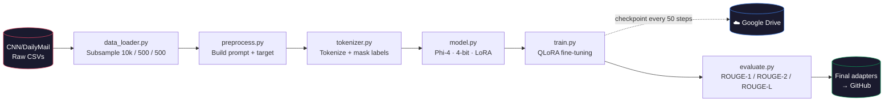

# Parameter-Efficient Fine-Tuning (PEFT) Microsoft Phi 4 (14-billion paramaters) model using Q LoRA

Fine-tuning **Microsoft Phi-4** (14B parameters, MIT license, fully open-weight)
for abstractive news summarization on the CNN/DailyMail dataset,
using **QLoRA** (4-bit quantization + LoRA adapters).


-9146FF.svg)
-orange.svg)


## 📋 Table of Contents
 
- [Overview](#-overview)
- [Architecture](#-architecture)
- [Tech Stack](#-tech-stack)
- [Project Structure](#-project-structure)
- [Setup](#-setup)
- [Usage](#-usage)
- [Resilience Features](#-resilience-features)
- [Results](#-results)
- [Engineering Challenges & Solutions](#-engineering-challenges--solutions)
- [Applications](#-applications)
- [License](#-license)

## Overview

This project takes **Microsoft Phi-4** — a 14-billion-parameter, fully open-weight (MIT license) model — and specializes it for one task: 
**abstractive summarization of news articles**, trained on the CNN/DailyMail dataset.
 
Rather than fine-tuning all 14B parameters (which would need a data-center GPU), this uses **QLoRA**: 
the base model is frozen and loaded in **4-bit precision**, and only small trainable **LoRA adapters** are updated. 

The result is a model that learns the summarization task while touching well under 1% of the original parameters 
— practical enough to train end-to-end on a single T4 GPU.

  TLDR -

- **Base model:** [microsoft/phi-4](https://huggingface.co/microsoft/phi-4) — chosen for being fully open-weight (MIT license)
              while remaining a large (14B params) model with strong reported benchmark performance for its size.
- **Method:** QLoRA — base weights frozen and loaded in 4-bit precision; small trainable LoRA adapters attached to attention projection layers.
- **Dataset:** CNN/DailyMail 3.0.0, subsampled to 10,000 train / 500 validation / 500 test examples.
- **Evaluation:** ROUGE-1, ROUGE-2, ROUGE-L, using greedy decoding for deterministic results.


## Architecture
 



## Tech Stack
 
| Layer | Tool |
|---|---|
| Base model | [`microsoft/phi-4`](https://huggingface.co/microsoft/phi-4) (14B, MIT license) |
| Fine-tuning | `transformers`, `peft` (LoRA), `bitsandbytes` (4-bit QLoRA) |
| Data | `datasets` — CNN/DailyMail 3.0.0 |
| Evaluation | `rouge-score` (ROUGE-1 / 2 / L) |
| Compute | Google Colab (free-tier T4 GPU) |
| Persistence | Google Drive (checkpoints) + GitHub (code, final adapters) |


## Project structure

microsoft-phi-PEFT/
├── dataset/
│ ├── raw/       # train/validation/test CSVs (gitignored)
│ └── processed/ # gitignored, regenerated at runtime
├── models/
│ ├── base/   # gitignored
│ └── lora/   # final adapters (committed) + checkpoints (gitignored)
├── src/
│ ├── config.py      # central configuration — paths, hyperparameters
│ ├── data_loader.py # CSV loading + reproducible subsampling
│ ├── preprocess.py  # prompt/target pair construction
│ ├── tokenizer.py   # tokenization + label masking
│ ├── model.py       # loads Phi-4 in 4-bit + LoRA attachment
│ ├── train.py       # training loop (with checkpoints & interruption handling)
│ └── evaluate.py    # ROUGE evaluation
├── main.py             # full pipeline entry point
├── evaluate_only.py    # evaluation only — requires existing adapters
├── PROJECT_STATE.md    # current build status / handoff notes
└── README.md


## Setup

```bash
git clone https://github.com/vatsmanu728/microsoft-phi-PEFT.git
cd microsoft-phi-PEFT
pip install -q datasets transformers peft bitsandbytes accelerate rouge-score sentencepiece tqdm
```


### Dataset

Raw CSVs are gitignored (too large for version control).
Generate the dataset splits from the Hugging Face source:

```python
from datasets import load_dataset

for split, filename in [("train", "train.csv"), ("validation", "validation.csv"), ("test", "test.csv")]:
    ds = load_dataset("abisee/cnn_dailymail", "3.0.0", split=split)
    ds.to_pandas()[["id", "article", "highlights"]].to_csv(f"dataset/raw/{filename}", index=False)
```


## Usage

```bash
# Full pipeline — trains if no adapters exist, then evaluates
python main.py
 
# Evaluation only — requires adapters already trained and saved
python evaluate_only.py
 
# Run any individual stage in isolation
python -m src.data_loader
python -m src.tokenizer
python -m src.model
python -m src.data_loader
python -m src.preprocess
python -m src.tokenizer
python -m src.model
```


## Environment notes

- **Requires a GPU** for `model.py`, `train.py`, and `evaluate.py` (4-bit quantization needs CUDA).
- Also runs on Kaggle, Google Colab, or locally — `config.py` auto-detects the environment and adjusts paths accordingly.
- On Colab: local disk is ephemeral (wiped on every runtime restart). LoRA adapters are saved to Google Drive so they persist across sessions.


## Resilience Features
 
Built specifically for the reality of compute constraints — interruptions are treated as *expected*, not exceptional:
 
- ✅ **Checkpoint every 50 training steps**, not just at epoch-end
- ✅ **Automatic resume** — reruns pick up exactly where a cut-off session left off
- ✅ **Incremental evaluation saving** — a killed evaluation run resumes mid-test-set, not from zero
- ✅ **Isolated smoke-testing** — every module is verified end-to-end before any full-scale run


## Results
 
*ROUGE scores will be added here once the full training + evaluation run completes.*
 
| Metric | Score |
|---|---|
| ROUGE-1 | TBD |
| ROUGE-2 | TBD |
| ROUGE-L | TBD |


## Engineering Challenges & Solutions
 
Real fine-tuning on constrained hardware surfaces problems no tutorial mentions. This table is the honest log of what actually broke and how it was fixed:
 
| Challenge | Root Cause | Solution |
|---|---|---|
| **83% of training examples had zero learning signal** | Long articles consumed the entire 1024-token window before truncation, wiping out the target summary — every label ended up masked (`-100`) | Reserve a fixed token budget for the target *before* truncating the prompt, guaranteeing every example retains real signal |
| **`ValueError` on model load** | `device_map="auto"` split the quantized model across GPU **and** CPU/disk — unsupported by 4-bit quantization | Force single-GPU placement: `device_map={"": 0}` |
| **Inefficient training precision on T4** | T4 (Turing architecture) lacks real bf16 Tensor Core support; `bf16=True` silently degrades performance | Switched to `fp16` throughout — compute dtype, training args, and quantization config |
| **Total loss of progress on GPU quota cutoff** | Default `save_strategy="epoch"` with 1 epoch means a checkpoint is only written at the very end | Step-based checkpointing (`save_steps=50`) + automatic `resume_from_checkpoint` detection |
| **Same risk during evaluation (500 sequential generations)** | No checkpointing concept in a plain generation loop | Incremental JSONL result-writing after every example, with automatic resume from the last completed one |
| **Silent stale-cache bugs during iteration** | `datasets.map()` fingerprinting can miss changes inside a closure, silently reusing outdated tokenization | Disabled `.map()` caching for this pipeline; verified fixes via fresh subprocess runs, not in-memory reruns |


## Applications
 
Summarization is one of the highest-leverage applications of LLMs in production today —

meeting-note tools, support-ticket triage, information aggregators and research digest tools all run on some version of this exact pipeline. 

This project demonstrates the **complete, real-world workflow** behind that pattern:
 
- Working with a **gated-free, large open-weight model** at genuine 14B scale
- **Parameter-efficient fine-tuning** under real hardware constraints, not idealized cloud compute
- **Production-grade resilience** — the kind of thing tutorials skip and real deployments can't


## 📄 License
 
MIT — see the base model's [license](https://huggingface.co/microsoft/phi-4) for terms governing Phi-4 itself.
